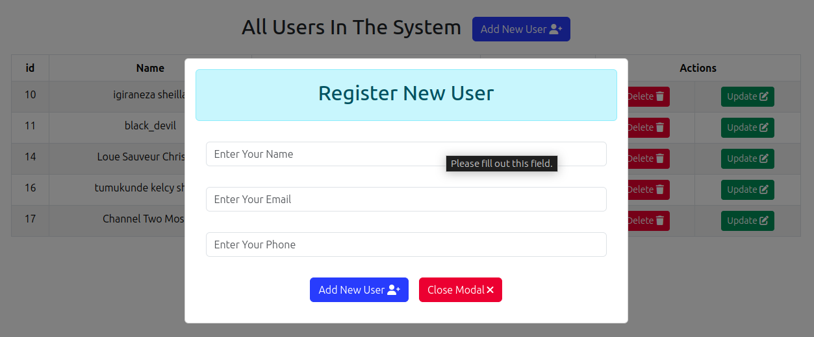

# Manage Data with React: CRUD Operations

---

### Introduction

This repository contains a project demonstrating CRUD (Create, Read, Update, Delete) operations using React for managing data. It offers functionalities to register users and perform various operations on their information.
## Preview Of Project

``**View Of All Users and Delete Any User**``


``**Modal To Register New Users**``


``**Modal To Update Users**``

### Requirements

Before running this project, ensure you have the following set up:

- **MySQL Server:** Install and set up a MySQL server.
- **Database Import:** Import the database file provided in the `db` folder into your MySQL server.
- **Node.js:** Make sure Node.js is installed on your system.

### Getting Started

Follow these steps to run the project:

1. **Clone the Repository:**
   ```
   git clone https://github.com/lscblack/Manage-Data-with-React-CRUD-Operations.git
   cd Manage-Data-with-React-CRUD-Operations
   ```
## Additional Steps

1. **Root Directory:**
   ```bash
   npm install
   ```

2. **Server Directory:**
   ```bash
   cd server
   npm install
   ```

3. **Client Directory:**
   ```bash
   cd ../client
   npm install
   ```

4. **Install `react-dom` in the Client Directory:**
   ```bash
   npm install react-dom
   ```
### Continue On The Steps After Installation
2. **Start the Server:**
   - Navigate to the server directory:
     ```
     cd ../server
     ```
   - Start the server:
     ```
     npm start
     ```

3. **Run the Client:**
   - Move to the client directory:
     ```
     cd ../client
     ```
   - Start the client:
     ```
     npm run dev
     ```

Make sure to import the database file into your MySQL server before executing the above commands.

### Importing the Database

To use the project's functionalities, import the database file provided in the `db` folder into your MySQL server.

### License

This repository is released under the MIT License.

### Author

- **LSCBLACK (Loue Sauevur Christian)**

---

This project simplifies data management using React. If you encounter any issues or have suggestions for improvement, feel free to explore or contribute to the project! If you need further assistance, don't hesitate to reach out.

### This Is The Preview Of App Interface after Installation


